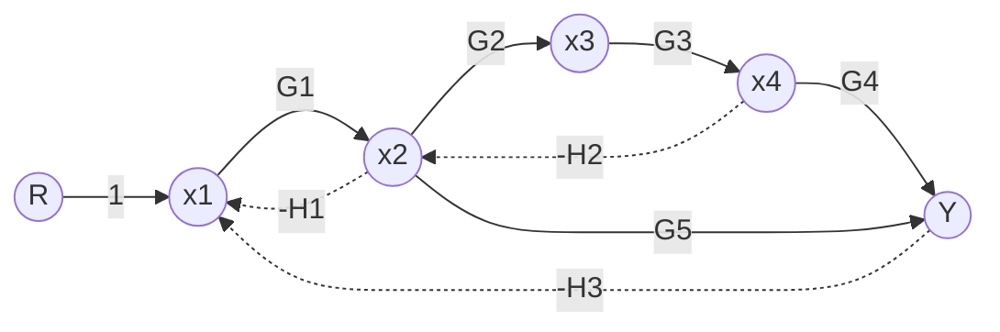
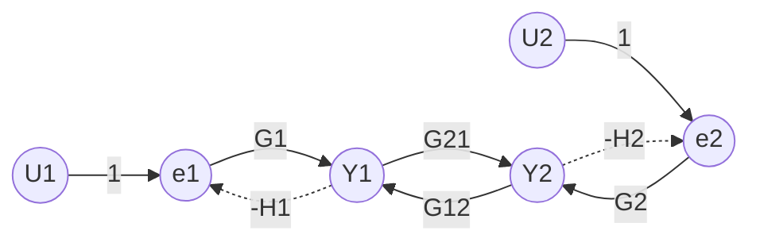
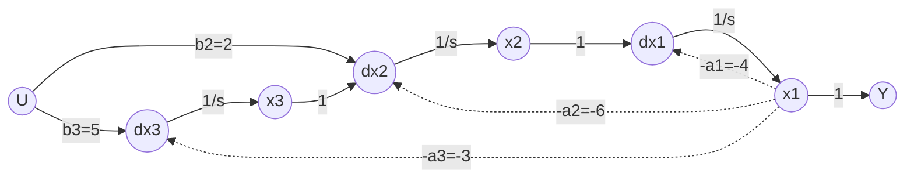
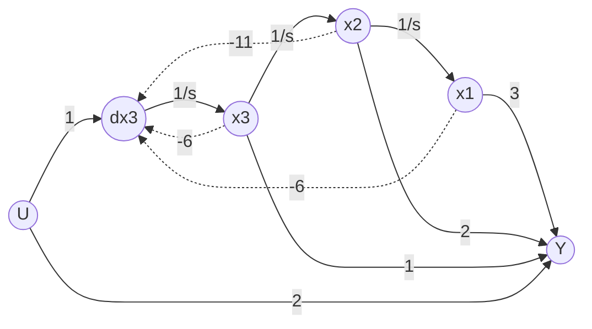
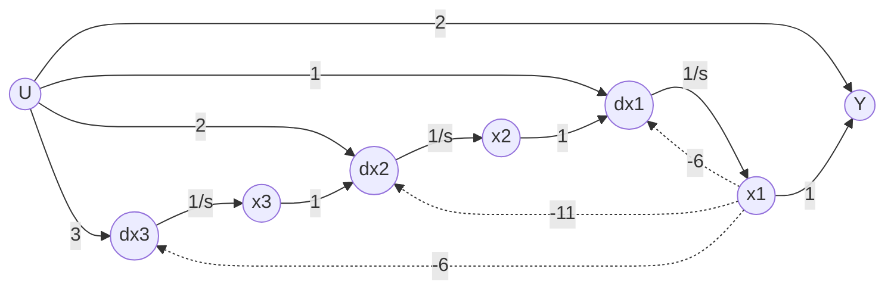
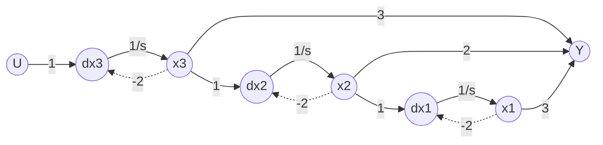

# Lembar Latihan dan Pembahasan Lengkap
## Topik 02: Pemodelan Sistem Dinamik
**Mata Kuliah:** MA4171 Teori Kontrol Linear

---

### **No. 1**

**Soal:**  
Suatu sistem mekanik translasi terdiri dari dua massa $m_1$ dan $m_2$ yang berada di atas lantai licin tanpa gesekan. Massa $m_1$ digerakkan oleh gaya luar $u(t)$ dan dihubungkan ke dinding diam di sebelah kiri melalui pegas $k_1$ dan peredam viskos $b_1$. Di antara massa $m_1$ dan $m_2$, terpasang pegas kedua $k_2$ dan peredam kedua $b_2$. Posisi perpindahan translasi massa $m_1$ dinyatakan sebagai $y_1(t)$ dan massa $m_2$ sebagai $y_2(t)$, keduanya diukur ke arah kanan dari posisi kesetimbangan masing-masing.

(a) Turunkan sistem persamaan diferensial gerak kedua massa.  
(b) Tentukan representasi ruang keadaan matriks standar $(A, B, C, D)$ dengan vektor keadaan $\mathbf{x}(t) = [y_1, \dot{y}_1, y_2, \dot{y}_2]^T$ dan vektor keluaran $\mathbf{y}(t) = [y_1, y_2]^T$.  
(c) Jika $m_1 = 1\text{ kg}$, $m_2 = 1\text{ kg}$, $k_1 = 3\text{ N/m}$, $k_2 = 2\text{ N/m}$, $b_1 = 2\text{ N}\cdot\text{s/m}$, dan $b_2 = 1\text{ N}\cdot\text{s/m}$, tentukan fungsi alih $G_1(s) = \frac{Y_1(s)}{U(s)}$ dan $G_2(s) = \frac{Y_2(s)}{U(s)}$.

**Penyelesaian:**

**(a) Penurunan Persamaan Diferensial Gerak**

Ditinjau diagram benda bebas untuk masing-masing massa sesuai dengan Hukum II Newton.

Untuk massa pertama ($m_1$), gaya penggerak adalah gaya luar $u(t)$, sedangkan gaya penahan berasal dari pegas $k_1$, peredam $b_1$, pegas penghubung $k_2$, dan peredam penghubung $b_2$:
$$m_1 \ddot{y}_1(t) = u(t) - k_1 y_1(t) - b_1 \dot{y}_1(t) - k_2 [y_1(t) - y_2(t)] - b_2 [\dot{y}_1(t) - \dot{y}_2(t)]$$

Penyusunan ulang suku-suku menghasilkan:
$$m_1 \ddot{y}_1(t) + (b_1 + b_2) \dot{y}_1(t) - b_2 \dot{y}_2(t) + (k_1 + k_2) y_1(t) - k_2 y_2(t) = u(t)$$

Untuk massa kedua ($m_2$), gaya yang bekerja sepenuhnya berasal dari interaksi elemen penghubung dengan massa pertama:
$$m_2 \ddot{y}_2(t) = k_2 [y_1(t) - y_2(t)] + b_2 [\dot{y}_1(t) - \dot{y}_2(t)]$$

Pengelompokan suku-suku menghasilkan:
$$m_2 \ddot{y}_2(t) - b_2 \dot{y}_1(t) + b_2 \dot{y}_2(t) - k_2 y_1(t) + k_2 y_2(t) = 0$$

**(b) Pembentukan Model Ruang Keadaan**

Dengan memilih variabel keadaan $x_1 = y_1, x_2 = \dot{y}_1, x_3 = y_2, x_4 = \dot{y}_2$, turunan pertama masing-masing variabel keadaan adalah:
$$\dot{x}_1 = x_2, \quad \dot{x}_2 = -\frac{k_1 + k_2}{m_1} x_1 - \frac{b_1 + b_2}{m_1} x_2 + \frac{k_2}{m_1} x_3 + \frac{b_2}{m_1} x_4 + \frac{1}{m_1} u$$
$$\dot{x}_3 = x_4, \quad \dot{x}_4 = \frac{k_2}{m_2} x_1 + \frac{b_2}{m_2} x_2 - \frac{k_2}{m_2} x_3 - \frac{b_2}{m_2} x_4$$

Dalam bentuk matriks $\dot{\mathbf{x}} = A\mathbf{x} + B u$ dan $\mathbf{y} = C\mathbf{x} + D u$:
$$A = \begin{bmatrix} 0 & 1 & 0 & 0 \\ -\frac{k_1 + k_2}{m_1} & -\frac{b_1 + b_2}{m_1} & \frac{k_2}{m_1} & \frac{b_2}{m_1} \\ 0 & 0 & 0 & 1 \\ \frac{k_2}{m_2} & \frac{b_2}{m_2} & -\frac{k_2}{m_2} & -\frac{b_2}{m_2} \end{bmatrix}, \quad B = \begin{bmatrix} 0 \\ \frac{1}{m_1} \\ 0 \\ 0 \end{bmatrix}, \quad C = \begin{bmatrix} 1 & 0 & 0 & 0 \\ 0 & 0 & 1 & 0 \end{bmatrix}, \quad D = \begin{bmatrix} 0 \\ 0 \end{bmatrix}$$

**(c) Penentuan Fungsi Alih**

Melalui Transformasi Laplace persamaan gerak dengan kondisi awal nol dan substitusi nilai numerik:
$$(s^2 + 3s + 5) Y_1(s) - (s + 2) Y_2(s) = U(s)$$
$$-(s + 2) Y_1(s) + (s^2 + s + 2) Y_2(s) = 0 \implies Y_2(s) = \frac{s + 2}{s^2 + s + 2} Y_1(s)$$

Substitusi $Y_2(s)$ ke persamaan pertama menghasilkan:
$$\left[ (s^2 + 3s + 5) - \frac{(s+2)^2}{s^2 + s + 2} \right] Y_1(s) = U(s)$$
$$\frac{s^4 + 4s^3 + 9s^2 + 7s + 6}{s^2 + s + 2} Y_1(s) = U(s)$$

Sehingga diperoleh fungsi alih masing-masing keluaran:
$$G_1(s) = \frac{Y_1(s)}{U(s)} = \frac{s^2 + s + 2}{s^4 + 4s^3 + 9s^2 + 7s + 6}$$
$$G_2(s) = \frac{Y_2(s)}{U(s)} = \frac{s + 2}{s^4 + 4s^3 + 9s^2 + 7s + 6}$$

---

### **No. 2**

**Soal:**  
Suatu rangkaian listrik terdiri dari sumber tegangan masukan $u(t) = v_{in}(t)$, resistor $R_1$, induktor $L$, kapasitor $C_1$, resistor $R_2$, dan kapasitor $C_2$. Arus pada induktor dinotasikan sebagai $i_L(t)$, tegangan pada kapasitor pertama sebagai $v_{C1}(t)$, dan tegangan pada kapasitor kedua sebagai $v_{C2}(t)$ yang sekaligus menjadi tegangan keluaran $y(t) = v_{C2}(t)$. Rangkaian tersusun dalam bentuk tangga (*ladder network*) di mana masukan terhubung seri dengan $R_1$ dan $L$ menuju simpul kapasitor $C_1$ (terhubung paralel ke ground), yang kemudian dihubungkan melalui $R_2$ ke kapasitor $C_2$ (paralel ke ground).

(a) Terapkan Hukum Tegangan Kirchhoff (KVL) dan Hukum Arus Kirchhoff (KCL) untuk menurunkan persamaan dinamik rangkaian.  
(b) Susun representasi ruang keadaan dengan vektor keadaan $\mathbf{x}(t) = [i_L(t), v_{C1}(t), v_{C2}(t)]^T$.  
(c) Tentukan fungsi alih sistem $G(s) = \frac{V_{C2}(s)}{V_{in}(s)}$ dalam bentuk parameter umum.

**Penyelesaian:**

**(a) Penerapan KVL dan KCL**

KVL diterapkan pada loop masukan yang memuat sumber tegangan, resistor $R_1$, induktor $L$, dan kapasitor $C_1$:
$$v_{in}(t) - R_1 i_L(t) - L \frac{di_L(t)}{dt} - v_{C1}(t) = 0 \implies \frac{di_L}{dt} = -\frac{R_1}{L} i_L - \frac{1}{L} v_{C1} + \frac{1}{L} v_{in}$$

KCL diterapkan pada simpul tegangan $v_{C1}$, di mana arus induktor $i_L$ terbagi menjadi arus yang melewati kapasitor $C_1$ dan arus yang mengalir melalui resistor $R_2$ menuju kapasitor $C_2$:
$$i_L(t) = C_1 \frac{dv_{C1}(t)}{dt} + \frac{v_{C1}(t) - v_{C2}(t)}{R_2} \implies \frac{dv_{C1}}{dt} = \frac{1}{C_1} i_L - \frac{1}{R_2 C_1} v_{C1} + \frac{1}{R_2 C_1} v_{C2}$$

KCL diterapkan pada simpul tegangan $v_{C2}$, di mana arus dari resistor $R_2$ seluruhnya mengisi kapasitor $C_2$:
$$\frac{v_{C1}(t) - v_{C2}(t)}{R_2} = C_2 \frac{dv_{C2}(t)}{dt} \implies \frac{dv_{C2}}{dt} = \frac{1}{R_2 C_2} v_{C1} - \frac{1}{R_2 C_2} v_{C2}$$

**(b) Formulasi Model Ruang Keadaan**

Dengan mendefinisikan $x_1 = i_L$, $x_2 = v_{C1}$, dan $x_3 = v_{C2}$, sistem persamaan diferensial di atas dituliskan dalam bentuk matriks:
$$\begin{bmatrix} \dot{x}_1 \\ \dot{x}_2 \\ \dot{x}_3 \end{bmatrix} = \begin{bmatrix} -\frac{R_1}{L} & -\frac{1}{L} & 0 \\ \frac{1}{C_1} & -\frac{1}{R_2 C_1} & \frac{1}{R_2 C_1} \\ 0 & \frac{1}{R_2 C_2} & -\frac{1}{R_2 C_2} \end{bmatrix} \begin{bmatrix} x_1 \\ x_2 \\ x_3 \end{bmatrix} + \begin{bmatrix} \frac{1}{L} \\ 0 \\ 0 \end{bmatrix} u(t)$$

Persamaan keluaran untuk tegangan $y(t) = v_{C2}(t) = x_3(t)$ adalah:
$$y(t) = \begin{bmatrix} 0 & 0 & 1 \end{bmatrix} \begin{bmatrix} x_1 \\ x_2 \\ x_3 \end{bmatrix} + [0] u(t)$$

**(c) Penentuan Fungsi Alih Sistem**

Dalam domain Laplace dengan kondisi awal nol, persamaan simpul kedua menyatakan hubungan $V_{C1}(s)$ dan $V_{C2}(s)$:
$$V_{C1}(s) = (R_2 C_2 s + 1) V_{C2}(s)$$

Substitusi hubungan ini ke persamaan simpul pertama menghasilkan arus induktor:
$$I_L(s) = [R_2 C_1 C_2 s^2 + (C_1 + C_2) s] V_{C2}(s)$$

Substitusi $I_L(s)$ dan $V_{C1}(s)$ ke dalam persamaan KVL loop masukan $(L s + R_1) I_L(s) + V_{C1}(s) = V_{in}(s)$ menghasilkan fungsi alih:
$$G(s) = \frac{V_{C2}(s)}{V_{in}(s)} = \frac{1}{L R_2 C_1 C_2 s^3 + [L(C_1 + C_2) + R_1 R_2 C_1 C_2] s^2 + [R_1(C_1 + C_2) + R_2 C_2] s + 1}$$

---

### **No. 3**

**Soal:**  
Suatu motor arus searah terkendali jangkar (*armature-controlled DC motor*) memiliki resistansi armatur $R_a$, induktansi armatur $L_a$, konstanta torsi $K_t$, konstanta gaya gerak listrik balik (*back-emf*) $K_b$, momen inersia rotor $J$, dan koefisien gesekan redaman viskos $B_m$. Masukan sistem adalah tegangan armatur $u(t) = v_a(t)$, sedangkan keluaran yang diamati adalah posisi sudut rotor $y_1(t) = \theta(t)$ dan kecepatan sudut rotor $y_2(t) = \omega(t) = \dot{\theta}(t)$.

(a) Turunkan persamaan diferensial yang mengatur dinamika elektrik dan mekanik motor.  
(b) Susun model ruang keadaan dengan vektor keadaan $\mathbf{x}(t) = [\theta(t), \omega(t), i_a(t)]^T$.  
(c) Diberikan nilai parameter: $R_a = 2\,\Omega$, $L_a = 0.5\text{ H}$, $K_t = 0.1\text{ N}\cdot\text{m/A}$, $K_b = 0.1\text{ V}\cdot\text{s/rad}$, $J = 0.02\text{ kg}\cdot\text{m}^2$, dan $B_m = 0.01\text{ N}\cdot\text{m}\cdot\text{s/rad}$. Tentukan fungsi alih posisi $G_\theta(s) = \frac{\Theta(s)}{V_a(s)}$ dan fungsi alih kecepatan $G_\omega(s) = \frac{\Omega(s)}{V_a(s)}$.

**Penyelesaian:**

**(a) Penurunan Persamaan Dinamika Elektromekanik**

Sirkuit elektrik armatur memenuhi persamaan tegangan KVL dengan tegangan balik $e_b(t) = K_b \omega(t)$:
$$L_a \frac{di_a(t)}{dt} + R_a i_a(t) + K_b \omega(t) = v_a(t) \implies \frac{di_a}{dt} = -\frac{R_a}{L_a} i_a - \frac{K_b}{L_a} \omega + \frac{1}{L_a} v_a$$

Dinamika mekanik rotor memenuhi Hukum II Newton untuk gerak rotasi dengan torsi elektromagnetik $T_m(t) = K_t i_a(t)$:
$$J \frac{d\omega(t)}{dt} + B_m \omega(t) = K_t i_a(t) \implies \frac{d\omega}{dt} = -\frac{B_m}{J} \omega + \frac{K_t}{J} i_a$$

Hubungan antara posisi sudut dan kecepatan sudut rotor adalah $\frac{d\theta}{dt} = \omega(t)$.

**(b) Formulasi Model Ruang Keadaan**

Dengan variabel keadaan $x_1 = \theta, x_2 = \omega, x_3 = i_a$, matriks ruang keadaan dinyatakan sebagai:
$$\begin{bmatrix} \dot{x}_1 \\ \dot{x}_2 \\ \dot{x}_3 \end{bmatrix} = \begin{bmatrix} 0 & 1 & 0 \\ 0 & -\frac{B_m}{J} & \frac{K_t}{J} \\ 0 & -\frac{K_b}{L_a} & -\frac{R_a}{L_a} \end{bmatrix} \begin{bmatrix} x_1 \\ x_2 \\ x_3 \end{bmatrix} + \begin{bmatrix} 0 \\ 0 \\ \frac{1}{L_a} \end{bmatrix} u(t)$$

Persamaan keluaran untuk posisi dan kecepatan sudut rotor adalah:
$$\mathbf{y}(t) = \begin{bmatrix} 1 & 0 & 0 \\ 0 & 1 & 0 \end{bmatrix} \begin{bmatrix} x_1 \\ x_2 \\ x_3 \end{bmatrix} + \begin{bmatrix} 0 \\ 0 \end{bmatrix} u(t)$$

**(c) Penentuan Fungsi Alih Numerik**

Dalam domain Laplace dengan kondisi awal nol:
$$G_\omega(s) = \frac{\Omega(s)}{V_a(s)} = \frac{K_t}{(J s + B_m)(L_a s + R_a) + K_t K_b} = \frac{K_t}{J L_a s^2 + (J R_a + B_m L_a) s + (B_m R_a + K_t K_b)}$$

Substitusi nilai parameter numerik:
$$G_\omega(s) = \frac{0.1}{0.01 s^2 + 0.045 s + 0.03} = \frac{10}{s^2 + 4.5 s + 3}$$
$$G_\theta(s) = \frac{\Theta(s)}{V_a(s)} = \frac{10}{s(s^2 + 4.5 s + 3)} = \frac{10}{s^3 + 4.5 s^2 + 3s}$$

---

### **No. 4**

**Soal:**  
Suatu sistem tangki bertingkat terhubung (*interacting two-tank system*) memiliki dua tangki penampung cairan dengan luas penampang seragam $A_1$ dan $A_2$. Cairan masuk ke tangki 1 dengan laju volumetrik $u(t) = q_{in}(t)$. Cairan mengalir dari tangki 1 ke tangki 2 melalui pipa berhambatan hidrolik $R_1$ dengan debit $q_1(t) = \frac{h_1(t) - h_2(t)}{R_1}$, dan mengalir keluar dari tangki 2 ke udara bebas melalui pipa berhambatan $R_2$ dengan debit $q_2(t) = \frac{h_2(t)}{R_2}$. Variabel tinggi permukaan cairan pada masing-masing tangki adalah $h_1(t)$ dan $h_2(t)$, dengan keluaran sistem adalah $y(t) = h_2(t)$.

(a) Turunkan persamaan diferensial neraca massa laju aliran untuk kedua tangki.  
(b) Susun representasi ruang keadaan matriks dengan vektor keadaan $\mathbf{x}(t) = [h_1(t), h_2(t)]^T$.  
(c) Tentukan fungsi alih loop terbuka $G(s) = \frac{H_2(s)}{Q_{in}(s)}$.

**Penyelesaian:**

**(a) Penurunan Persamaan Neraca Massa**

Neraca massa cairan pada tangki 1:
$$A_1 \frac{dh_1(t)}{dt} = q_{in}(t) - q_1(t) = u(t) - \frac{h_1(t) - h_2(t)}{R_1} \implies \frac{dh_1}{dt} = -\frac{1}{A_1 R_1} h_1 + \frac{1}{A_1 R_1} h_2 + \frac{1}{A_1} u$$

Neraca massa cairan pada tangki 2:
$$A_2 \frac{dh_2(t)}{dt} = q_1(t) - q_2(t) = \frac{h_1(t) - h_2(t)}{R_1} - \frac{h_2(t)}{R_2} \implies \frac{dh_2}{dt} = \frac{1}{A_2 R_1} h_1 - \left( \frac{1}{A_2 R_1} + \frac{1}{A_2 R_2} \right) h_2$$

**(b) Formulasi Model Ruang Keadaan**

Dengan vektor keadaan $\mathbf{x} = [h_1, h_2]^T$ dan masukan $u = q_{in}$:
$$\begin{bmatrix} \dot{h}_1 \\ \dot{h}_2 \end{bmatrix} = \begin{bmatrix} -\frac{1}{A_1 R_1} & \frac{1}{A_1 R_1} \\ \frac{1}{A_2 R_1} & -\left(\frac{1}{A_2 R_1} + \frac{1}{A_2 R_2}\right) \end{bmatrix} \begin{bmatrix} h_1 \\ h_2 \end{bmatrix} + \begin{bmatrix} \frac{1}{A_1} \\ 0 \end{bmatrix} u(t), \quad y(t) = \begin{bmatrix} 0 & 1 \end{bmatrix} \begin{bmatrix} h_1 \\ h_2 \end{bmatrix} + [0] u(t)$$

**(c) Penentuan Fungsi Alih Sistem**

Melalui eliminasi aljabar Laplace diperoleh:
$$G(s) = \frac{H_2(s)}{Q_{in}(s)} = \frac{R_2}{A_1 A_2 R_1 R_2 s^2 + (A_1 R_1 + A_1 R_2 + A_2 R_2) s + 1}$$

---

### **No. 5**

**Soal:**  
Suatu sistem kendali loop tertutup dengan konfigurasi umpan balik ganda memiliki hubungan blok sebagai berikut: sinyal masukan $R(s)$ masuk ke titik penjumlahan 1 (+) bersama umpan balik negatif $-H_2(s) Y(s)$ menghasilkan sinyal $E_1(s)$. Sinyal $E_1(s)$ melewati blok $G_1(s)$ menuju titik penjumlahan 2 (+), yang juga menerima umpan balik negatif $-H_1(s)$ dari keluaran blok $G_2(s)$. Keluaran titik penjumlahan 2 masuk ke blok $G_2(s)$, menghasilkan sinyal $V(s)$. Sinyal $V(s)$ dijumlahkan di titik penjumlahan 3 (+) dengan sinyal *feedforward* $+G_3(s) E_1(s)$, dan hasilnya melewati blok $G_4(s)$ untuk menghasilkan keluaran akhir $Y(s)$.

(a) Tuliskan persamaan aljabar sinyal pada setiap titik percabangan dan titik penjumlahan.  
(b) Lakukan reduksi diagram blok secara analitis untuk menentukan fungsi alih loop tertutup $T(s) = \frac{Y(s)}{R(s)}$.

**Penyelesaian:**

**(a) Persamaan Aljabar Diagram Blok**

$$E_1(s) = R(s) - H_2(s) Y(s)$$
$$V(s) = G_2(s) \left[ G_1(s) E_1(s) - H_1(s) V(s) \right]$$
$$Y(s) = G_4(s) \left[ V(s) + G_3(s) E_1(s) \right]$$

**(b) Reduksi Aljabar Fungsi Alih**

$$V(s) = \frac{G_1(s) G_2(s)}{1 + G_2(s) H_1(s)} E_1(s)$$
$$Y(s) = G_4(s) \left[ \frac{G_1(s) G_2(s) + G_3(s)(1 + G_2(s) H_1(s))}{1 + G_2(s) H_1(s)} \right] [R(s) - H_2(s) Y(s)]$$

Pengelompokan menghasilkan:
$$T(s) = \frac{Y(s)}{R(s)} = \frac{G_1(s) G_2(s) G_4(s) + G_3(s) G_4(s) + G_2(s) G_3(s) G_4(s) H_1(s)}{1 + G_2(s) H_1(s) + H_2(s) G_4(s) [G_1(s) G_2(s) + G_3(s) + G_2(s) G_3(s) H_1(s)]}$$

---

### **No. 6**

**Soal:**  
Diberikan diagram aliran sinyal (*Signal Flow Graph* / SFG) dengan simpul masukan $R(s) = x_0$, simpul internal $x_1, x_2, x_3, x_4$, dan simpul keluaran $Y(s) = x_5$. Transmisi antar-simpul diberikan oleh hubungan berikut:
$$x_1 = R - H_1 x_2 - H_3 x_5, \quad x_2 = G_1 x_1 - H_2 x_4, \quad x_3 = G_2 x_2, \quad x_4 = G_3 x_3, \quad x_5 = G_4 x_4 + G_5 x_2$$



(a) Tentukan semua lintasan maju (*forward paths*) beserta penguatannya ($F_k$).  
(b) Tentukan semua loop umpan balik tunggal ($L_i$) dan pasangan loop tak bersentuhan (*non-touching loops*).  
(c) Hitung determinan graf $\Delta$ dan kofaktor lintasan $\Delta_k$.  
(d) Tentukan fungsi alih total $G(s) = \frac{Y(s)}{R(s)}$ menggunakan Rumus Penguatan Mason.

**Penyelesaian:**

**(a) Penentuan Lintasan Maju ($F_k$)**

- Lintasan utama: $F_1 = G_1 G_2 G_3 G_4$
- Lintasan pintas (*feedforward*): $F_2 = G_1 G_5$

**(b) Penentuan Loop Tunggal dan Pasangan Loop Saling Lepas**

$$L_1 = -G_1 H_1, \quad L_2 = -G_2 G_3 H_2, \quad L_3 = -G_1 G_2 G_3 G_4 H_3, \quad L_4 = -G_1 G_5 H_3$$
Semua loop saling berbagi setidaknya satu simpul, sehingga **tidak ada pasangan loop yang saling lepas**.

**(c) Perhitungan Determinan $\Delta$ dan Kofaktor $\Delta_k$**

$$\Delta = 1 + G_1 H_1 + G_2 G_3 H_2 + G_1 G_2 G_3 G_4 H_3 + G_1 G_5 H_3, \quad \Delta_1 = 1, \quad \Delta_2 = 1$$

**(d) Perhitungan Fungsi Alih Total dengan Rumus Mason**

$$G(s) = \frac{Y(s)}{R(s)} = \frac{G_1 G_2 G_3 G_4 + G_1 G_5}{1 + G_1 H_1 + G_2 G_3 H_2 + G_1 G_2 G_3 G_4 H_3 + G_1 G_5 H_3}$$

---

### **No. 7**

**Soal:**  
Suatu sistem terkopel 2-masukan 2-keluaran (MIMO) memiliki hubungan sinyal internal yang direpresentasikan oleh SFG dengan masukan $U_1, U_2$ dan keluaran $Y_1, Y_2$ sebagai berikut:
$$Y_1 = G_1 [U_1 - H_1 Y_1] + G_{12} Y_2, \quad Y_2 = G_2 [U_2 - H_2 Y_2] + G_{21} Y_1$$



Tentukan matriks fungsi alih transfer sistem $\mathbf{G}_{MIMO}(s)$ sedemikian sehingga $\begin{bmatrix} Y_1(s) \\ Y_2(s) \end{bmatrix} = \mathbf{G}_{MIMO}(s) \begin{bmatrix} U_1(s) \\ U_2(s) \end{bmatrix}$.

**Penyelesaian:**

$$\begin{bmatrix} 1 + G_1 H_1 & -G_{12} \\ -G_{21} & 1 + G_2 H_2 \end{bmatrix} \begin{bmatrix} Y_1 \\ Y_2 \end{bmatrix} = \begin{bmatrix} G_1 & 0 \\ 0 & G_2 \end{bmatrix} \begin{bmatrix} U_1 \\ U_2 \end{bmatrix}$$

$$\Delta = (1 + G_1 H_1)(1 + G_2 H_2) - G_{12} G_{21}$$

$$\mathbf{G}_{MIMO}(s) = \frac{1}{(1 + G_1 H_1)(1 + G_2 H_2) - G_{12} G_{21}} \begin{bmatrix} G_1(1 + G_2 H_2) & G_2 G_{12} \\ G_1 G_{21} & G_2(1 + G_1 H_1) \end{bmatrix}$$

---

### **No. 8**

**Soal:**  
Diberikan diagram aliran sinyal yang tersusun atas 3 buah integrator berurutan ($1/s$) dengan variabel keadaan $x_1, x_2, x_3$ didefinisikan sebagai sinyal keluaran dari masing-masing integrator dari kiri ke kanan. Topologi percabangan sistem didefinisikan sebagai:
$$\dot{x}_1 = -a_1 x_1 + x_2 + b_1 u, \quad \dot{x}_2 = -a_2 x_1 + x_3 + b_2 u, \quad \dot{x}_3 = -a_3 x_1 + b_3 u, \quad y = c_1 x_1 + c_2 x_2 + c_3 x_3 + d u$$



Susun matriks ruang keadaan $(A, B, C, D)$ sistem tersebut secara langsung dan tentukan fungsi alih $G(s) = \frac{Y(s)}{U(s)}$ ketika $b_1=0, b_2=2, b_3=5, a_1=4, a_2=6, a_3=3, c_1=1, c_2=0, c_3=0, d=0$.

**Penyelesaian:**

Dari relasi topologi simpul, matriks dinamik sistem dalam bentuk *Observable Canonical Form* (OCF) adalah:
$$A = \begin{bmatrix} -4 & 1 & 0 \\ -6 & 0 & 1 \\ -3 & 0 & 0 \end{bmatrix}, \quad B = \begin{bmatrix} 0 \\ 2 \\ 5 \end{bmatrix}, \quad C = \begin{bmatrix} 1 & 0 & 0 \end{bmatrix}, \quad D = [0]$$

Determinan matriks karakteristik:
$$\det(sI - A) = s^3 + 4s^2 + 6s + 3$$

Fungsi alih sistem diperoleh melalui perumusan $Y(s) = X_1(s)$:
$$s X_1(s) = -4 X_1(s) + X_2(s) \implies X_2(s) = (s+4) X_1(s)$$
$$s X_2(s) = -6 X_1(s) + X_3(s) + 2 U(s) \implies X_3(s) = (s^2 + 4s + 6) X_1(s) - 2 U(s)$$
$$s X_3(s) = -3 X_1(s) + 5 U(s) \implies (s^3 + 4s^2 + 6s + 3) X_1(s) = (2s + 5) U(s)$$

Karena $Y(s) = X_1(s)$, maka fungsi alih sistem adalah:
$$G(s) = \frac{Y(s)}{U(s)} = \frac{2s + 5}{s^3 + 4s^2 + 6s + 3}$$

---

### **No. 9**

**Soal:**  
Diberikan fungsi alih rasional berderajat 3 bertipe *proper* sebagai berikut:
$$G(s) = \frac{2s^3 + 13s^2 + 24s + 15}{s^3 + 6s^2 + 11s + 6}$$

(a) Pisahkan suku transmisi langsung (*direct feedthrough*) $d_0$ dan bentuk fungsi alih menjadi bagian *strictly proper*.  
(b) Tentukan representasi ruang keadaan dalam Bentuk Kanonik Terkontrol (*Controllable Canonical Form* - CCF) dan gambarkan diagram aliran sinyalnya.

**Penyelesaian:**

**(a) Pemisahan Bagian Strictly Proper**

$$G(s) = 2 + \frac{s^2 + 2s + 3}{s^3 + 6s^2 + 11s + 6}$$
dengan $d_0 = 2$, $b_2 = 1, b_1 = 2, b_0 = 3$, serta koefisien penyebut $a_2 = 6, a_1 = 11, a_0 = 6$.

**(b) Formulasi Controllable Canonical Form (CCF) & Diagram SFG**

$$A_{CCF} = \begin{bmatrix} 0 & 1 & 0 \\ 0 & 0 & 1 \\ -6 & -11 & -6 \end{bmatrix}, \quad B_{CCF} = \begin{bmatrix} 0 \\ 0 \\ 1 \end{bmatrix}, \quad C_{CCF} = \begin{bmatrix} 3 & 2 & 1 \end{bmatrix}, \quad D_{CCF} = [2]$$



---

### **No. 10**

**Soal:**  
Gunakan fungsi alih yang sama dengan Soal No. 9:
$$G(s) = \frac{2s^3 + 13s^2 + 24s + 15}{s^3 + 6s^2 + 11s + 6} = 2 + \frac{s^2 + 2s + 3}{s^3 + 6s^2 + 11s + 6}$$

(a) Tentukan representasi ruang keadaan dalam Bentuk Kanonik Terobservasi (*Observable Canonical Form* - OCF) dan gambarkan diagram aliran sinyalnya.  
(b) Tunjukkan hubungan dualitas transpos antara matriks-matriks CCF dan OCF.

**Penyelesaian:**

**(a) Formulasi Observable Canonical Form (OCF) & Diagram SFG**

$$A_{OCF} = \begin{bmatrix} -6 & 1 & 0 \\ -11 & 0 & 1 \\ -6 & 0 & 0 \end{bmatrix}, \quad B_{OCF} = \begin{bmatrix} 1 \\ 2 \\ 3 \end{bmatrix}, \quad C_{OCF} = \begin{bmatrix} 1 & 0 & 0 \end{bmatrix}, \quad D_{OCF} = [2]$$



**(b) Analisis Dualitas Transpos**

$$A_{OCF} \sim A_{CCF}^T, \quad B_{OCF} \sim C_{CCF}^T, \quad C_{OCF} \sim B_{CCF}^T, \quad D_{OCF} = D_{CCF}$$

---

### **No. 11**

**Soal:**  
Diberikan fungsi alih sistem:
$$G(s) = \frac{s + 3}{(s + 1)(s + 2)(s + 4)}$$
Bentuklah representasi ruang keadaan dalam Bentuk Kanonik Kaskade (*Cascade/Series Form*) melalui faktorisasi menjadi perkalian tiga subsistem orde pertama berurutan $G(s) = G_1(s) G_2(s) G_3(s) = \left(\frac{1}{s+1}\right)\left(\frac{s+3}{s+2}\right)\left(\frac{1}{s+4}\right)$ dan gambarkan diagram alirannya.

**Penyelesaian:**

Didefinisikan sinyal perantara pada setiap tahapan kaskade:
- Subsistem pertama: $X_1(s) = \frac{1}{s+1} U(s) \implies \dot{x}_1(t) = -x_1(t) + u(t)$.
- Subsistem kedua: $V(s) = \frac{s+3}{s+2} X_1(s) = \left( 1 + \frac{1}{s+2} \right) X_1(s)$. Didefinisikan $X_2(s) = \frac{1}{s+2} X_1(s) \implies \dot{x}_2(t) = -2 x_2(t) + x_1(t)$, sehingga $v(t) = x_2(t) + x_1(t)$.
- Subsistem ketiga: $Y(s) = \frac{1}{s+4} V(s) \implies \dot{x}_3(t) = -4 x_3(t) + x_1(t) + x_2(t)$ dengan $y(t) = x_3(t)$.

Penggabungan seluruh persamaan dinamika menghasilkan sistem ruang keadaan berstruktur segitiga bawah (*lower triangular*):
$$\begin{bmatrix} \dot{x}_1 \\ \dot{x}_2 \\ \dot{x}_3 \end{bmatrix} = \begin{bmatrix} -1 & 0 & 0 \\ 1 & -2 & 0 \\ 1 & 1 & -4 \end{bmatrix} \begin{bmatrix} x_1 \\ x_2 \\ x_3 \end{bmatrix} + \begin{bmatrix} 1 \\ 0 \\ 0 \end{bmatrix} u(t), \quad y(t) = \begin{bmatrix} 0 & 0 & 1 \end{bmatrix} \begin{bmatrix} x_1 \\ x_2 \\ x_3 \end{bmatrix} + [0] u(t)$$

```mermaid
flowchart LR
    U((U)) -->|1/(s+1)| x1((x1))
    x1 -->|1/(s+2)| x2((x2))
    x2 -->|1/(s+4)| x3((y=x3))
    x1 -->|1/(s+4)| x3
```

---

### **No. 12**

**Soal:**  
Diberikan fungsi alih yang memiliki kombinasi pole real sederhana dan pole kompleks konjugat:
$$G(s) = \frac{5s^2 + 17s + 18}{(s + 1)(s^2 + 4s + 5)}$$

(a) Lakukan ekspansi pecahan parsial dari fungsi alih tersebut.  
(b) Susun representasi ruang keadaan dalam Bentuk Kanonik Modal Real (*Real Modal / Diagonal Form*).

**Penyelesaian:**

**(a) Ekspansi Pecahan Parsial**

$$c_1 = \lim_{s \to -1} (s+1) G(s) = 3 \implies G(s) = \frac{3}{s+1} + \frac{2s + 3}{s^2 + 4s + 5}$$

**(b) Formulasi Bentuk Kanonik Modal Real**

Matriks ruang keadaan modal real sistem adalah:
$$A = \begin{bmatrix} -1 & 0 & 0 \\ 0 & -2 & 1 \\ 0 & -1 & -2 \end{bmatrix}, \quad B = \begin{bmatrix} 1 \\ 2 \\ -1 \end{bmatrix}, \quad C = \begin{bmatrix} 3 & 1 & 0 \end{bmatrix}, \quad D = [0]$$

---

### **No. 13**

**Soal:**  
Diberikan fungsi alih yang memiliki pole berulang berorde 3:
$$G(s) = \frac{3s^2 + 14s + 19}{(s + 2)^3}$$

(a) Lakukan ekspansi pecahan parsial dari fungsi alih tersebut.  
(b) Tentukan representasi ruang keadaan dalam Bentuk Kanonik Jordan (*Jordan Canonical Form*) dan gambarkan diagram aliran sinyalnya.

**Penyelesaian:**

**(a) Ekspansi Pecahan Parsial Suku Pole Berulang**

$$G(s) = \frac{3}{s + 2} + \frac{2}{(s + 2)^2} + \frac{3}{(s + 2)^3}$$

**(b) Formulasi Bentuk Kanonik Jordan & Diagram SFG**

$$\dot{x}_3(t) = -2 x_3(t) + u(t), \quad \dot{x}_2(t) = -2 x_2(t) + x_3(t), \quad \dot{x}_1(t) = -2 x_1(t) + x_2(t)$$
$$y(t) = 3 x_1(t) + 2 x_2(t) + 3 x_3(t)$$

$$A = \begin{bmatrix} -2 & 1 & 0 \\ 0 & -2 & 1 \\ 0 & 0 & -2 \end{bmatrix}, \quad B = \begin{bmatrix} 0 \\ 0 \\ 1 \end{bmatrix}, \quad C = \begin{bmatrix} 3 & 2 & 3 \end{bmatrix}, \quad D = [0]$$



---

### **No. 14**

**Soal:**  
Tentukan realisasi ruang keadaan matriks $(A, B, C, D)$ untuk sistem multivariabel berikut:

(a) Sistem Satu Masukan Dua Keluaran (SIMO):
$$\mathbf{G}_{SIMO}(s) = \begin{bmatrix} \frac{s + 1}{s^2 + 5s + 6} \\ \frac{2s + 3}{s^2 + 5s + 6} \end{bmatrix}$$

(b) Sistem Dua Masukan Satu Keluaran (MISO):
$$\mathbf{G}_{MISO}(s) = \begin{bmatrix} \frac{s + 4}{s^2 + 3s + 2} & \frac{2s + 1}{s^2 + 3s + 2} \end{bmatrix}$$

**Penyelesaian:**

**(a) Realisasi SIMO ke Bentuk Controllable Canonical Form**

$$A = \begin{bmatrix} 0 & 1 \\ -6 & -5 \end{bmatrix}, \quad B = \begin{bmatrix} 0 \\ 1 \end{bmatrix}, \quad C = \begin{bmatrix} 1 & 1 \\ 3 & 2 \end{bmatrix}, \quad D = \begin{bmatrix} 0 \\ 0 \end{bmatrix}$$

**(b) Realisasi MISO ke Bentuk Observable Canonical Form**

$$A = \begin{bmatrix} -3 & 1 \\ -2 & 0 \end{bmatrix}, \quad B = \begin{bmatrix} 1 & 2 \\ 4 & 1 \end{bmatrix}, \quad C = \begin{bmatrix} 1 & 0 \end{bmatrix}, \quad D = \begin{bmatrix} 0 & 0 \end{bmatrix}$$

---

### **No. 15**

**Soal:**  
Diberikan matriks transfer multivariabel 2-masukan 2-keluaran (MIMO):
$$\mathbf{G}(s) = \begin{bmatrix} \frac{1}{s+1} & \frac{2}{s+2} \\ \frac{1}{(s+1)(s+2)} & \frac{1}{s+1} \end{bmatrix}$$

(a) Tentukan kutub-kutub karakteristik matriks alih dan lakukan ekspansi pecahan parsial matriks.  
(b) Tentukan matriks residu $W_i$ untuk setiap kutub, hitung rank masing-masing matriks residu, dan lakukan dekomposisi dyadic rank $W_i = C_i B_i$.  
(c) Susun matriks realisasi ruang keadaan minimal $(A, B, C, D)$ menggunakan Metode Gilbert dan verifikasi ordo minimalnya.

**Penyelesaian:**

**(a) Ekspansi Pecahan Parsial Matriks Alih**

Kutub-kutub sistem adalah $s_1 = -1$ dan $s_2 = -2$:
$$\mathbf{G}(s) = \frac{W_1}{s + 1} + \frac{W_2}{s + 2}$$

**(b) Perhitungan Matriks Residu dan Dekomposisi Dyadic**

Matriks residu pertama pada kutub $s_1 = -1$:
$$W_1 = \lim_{s \to -1} (s+1) \mathbf{G}(s) = \begin{bmatrix} 1 & 0 \\ 1 & 1 \end{bmatrix} \implies \operatorname{rank}(W_1) = 2$$
$$C_1 = W_1 = \begin{bmatrix} 1 & 0 \\ 1 & 1 \end{bmatrix}, \quad B_1 = I_2 = \begin{bmatrix} 1 & 0 \\ 0 & 1 \end{bmatrix}$$

Matriks residu kedua pada kutub $s_2 = -2$:
$$W_2 = \lim_{s \to -2} (s+2) \mathbf{G}(s) = \begin{bmatrix} 0 & 2 \\ -1 & 0 \end{bmatrix} \implies \operatorname{rank}(W_2) = 2$$
$$C_2 = W_2 = \begin{bmatrix} 0 & 2 \\ -1 & 0 \end{bmatrix}, \quad B_2 = I_2 = \begin{bmatrix} 1 & 0 \\ 0 & 1 \end{bmatrix}$$

**(c) Konstruksi Realisasi Minimal Gilbert**

Orde minimal sistem ruang keadaan: $n = k_1 + k_2 = 2 + 2 = 4$.

$$A = \begin{bmatrix} -1 & 0 & 0 & 0 \\ 0 & -1 & 0 & 0 \\ 0 & 0 & -2 & 0 \\ 0 & 0 & 0 & -2 \end{bmatrix}, \quad B = \begin{bmatrix} 1 & 0 \\ 0 & 1 \\ 1 & 0 \\ 0 & 1 \end{bmatrix}, \quad C = \begin{bmatrix} 1 & 0 & 0 & 2 \\ 1 & 1 & -1 & 0 \end{bmatrix}, \quad D = \begin{bmatrix} 0 & 0 \\ 0 & 0 \end{bmatrix}$$

Realisasi $(A, B, C, D)$ di atas terbukti merupakan realisasi ruang keadaan minimal berorde 4 bagi matriks transfer $\mathbf{G}(s)$.
